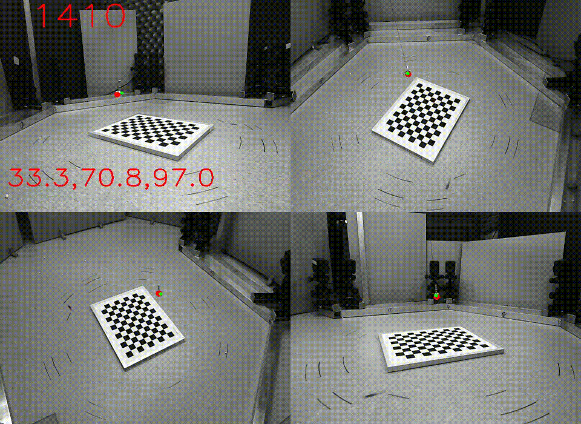
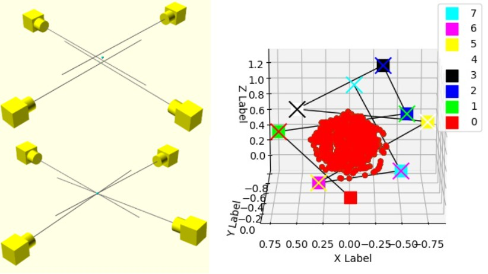
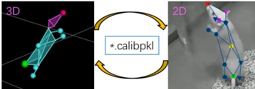
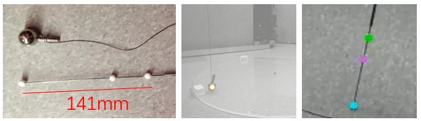
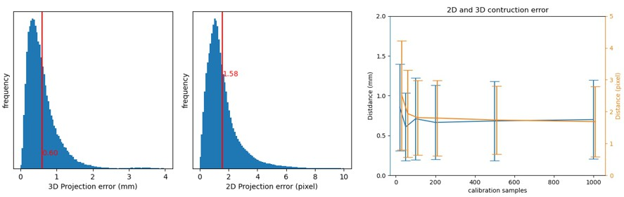

# Multiview Ball Calibration
Here is a python + opencv toolbox that can help you calibrate your multi-camera extrinsic parameters. All 2D and 3D position data are `numpy array` based.






## Python package install
I've assume that you've installed basic libs, like `opencv`, `numpy`, `scipy`. Here is the multive calib package, just install it.
The `multiview_calib` is modified from `https://github.com/cvlab-epfl/multiview_calib`, take care use my version.
```bash
pip install -U git+https://github.com/chenxinfeng4/multiview_calib
```

## Ball define and detect
You can use `single-ball` or `triple-ball`. 

!!! **The ball detector is not contain in this code**, so you should manually give me the position of ball in each view. 

> The `single-ball` or `triple-ball` are most the some pipeline. Except the triple-ball can restore the scale information. It will be helpful when you don't care about the world origin point and axes direction. Other wise I recommand you to use `single-ball` plus `checkboard`, which can onstep register `world axes`.




## Tutorial
The test data is contained in the tutorial. 

### Step1: Intrinsic Calibration
See the `1_intrinsic_calib/intrinsic_calib.ipynb`. You will get the `intrinsic_calib.json`.

### Step2: Ball Extrinsic Calibration
See the `2A_ball_extrinsic_calib/ball_extrinsic_calib.ipynb` and `2B_triball_extrinsic_calib/tripleball_extrinsic_calib.ipynb`. You will get the `*calibpkl`.

The calibpkl contains the all intrinsic & extrinsic parameters. 
> `K` (3, 3);  
> `dist` [K1, K2, T1, T2, K3];  
> `t` (3,);  
> `R` (3, 3); 

### Step3: World Axes Register
See the `3_worldaxes_register/worldaxes_register.ipynb`. You will get the refined calibration model `*.recalibpkl`.

### Step4: Mutural Transform 2D ⇌ 3D
See the `4_transform_between2D_and_3D/mutual_transform_2D_3D.ipynb`


## Performance and Precision
All 2D and 3D position data are `numpy array` based, so the calibration and reconstruction would be fast.
The calibration error is `0.6 mm` in 3D construction, and `1.6 pixel` in 2D image projection. Only 50-100 time slice ball-allview samples are enough for calibration. 




## Adapt to your own data
1. Your multiview videos, sure. All cameras should be synchronized. I recommend your to use OBS Studio grid arange the cameras and record into one file.
2. One `checkboard`. It's for `intrinsic` calibration. Also, it's for `world axes` registration.
3. One `single-ball` or one `triple-ball`. And also a ball detection software. In my case, I use `open-mmlab/mmpose`, it offer 1000 images/sec ball detection. The config of mmpose is not release in this code yet.
4. No ball detection in you case? Manually label 50 time slice ball-all-view samples. And extract the positions into a numpy array as (NVIEW, NSAMPLE, 1, XYP).

## Aknowledgement
- Great work from https://github.com/cvlab-epfl/multiview_calib .

## Extent readings
- [Single-ball calibration] Perez-Cortes, Juan-Carlos, et al. "A system for in-line 3D inspection without hidden surfaces." Sensors 18.9 (2018): 2993.
- [Multi-ball calibration] Perez, Alberto J., Juan-Carlos Perez-Cortes, and Jose-Luis Guardiola. "Simple and precise multi-view camera calibration for 3D reconstruction." Computers in Industry 123 (2020): 103256.
- [Triple-ball calibration] 吴福朝，王亮，胡占义. “一种对多相机系统的标定方法及装置” . 发明专利 (2008): CN 101226638A
